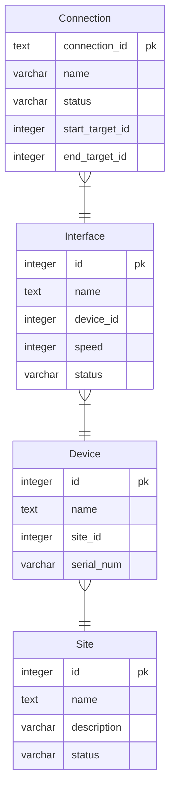

# Installation (Linux/MacOS)
Create a venv
`python -m venv .venv`

Activate the virutal environment
`source .venv/bin/activate`

Install dependencies
`pip install -r requirements.txt

# Installation (Windows)
For Windows installation, follow this guide to install deps from requirements.txt: https://packaging.python.org/en/latest/guides/installing-using-pip-and-virtual-environments/

# Running The App 
From the network_tracer directory:
**Seeding the DB**: `python manage.py seed`

**Run the Development Server**: `python manage.py runserver`

**Run containerised deployment**: ``

# Running Tests
From the network_tracer directory:

**All tests**: `python manage.py test api`

**Integration tests only**: `python manage.py test api.tests.integration`

**Unit tests only**: `python manage.py test api.tests.unit`

**With verbose output:** `python manage.py test api --verbosity=2`

# Assumptions
- When Site deleted, delete all devices associated with it as we won't need them anymore
- Interfaces can create a connection to themselves (loopback)
- This system isn't ready for deployment and is just an implementaiton of the API and business logic. 

# High-Level Design
# Data Model
Data model below was generated using the following command:
`python manage.py generate_erd --format mermaid --output schema.md`



## Project Structure
```
├── network_tracer
│   ├── api
│   │   ├── admin.py
│   │   ├── apps.py
│   │   ├── management/
│   │   │   ├── commands/       # contains adminstrative commands, such as seeding the database
│   │   ├── migrations          # contains Django migration files
│   │   ├── models.py           # all models for the API
│   │   ├── repository.py       # data access logic
│   │   ├── serializers.py      # serialises/deseralisation models for views
│   │   ├── tests
│   │   │   ├── integration     # integration tests - runs with real database/API integraton
│   │   │   └── unit            # unit tests - isolated business logic-level tests
│   │   └── views.py            # endpoint definitoins
│   ├── manage.py
│   └── network_tracer
│       ├── asgi.py             
│       ├── settings.py         # project-wide settings
│       ├── urls.py             # URL/Router configs
│       └── wsgi.py
├── README.md
└── requirements.txt
```